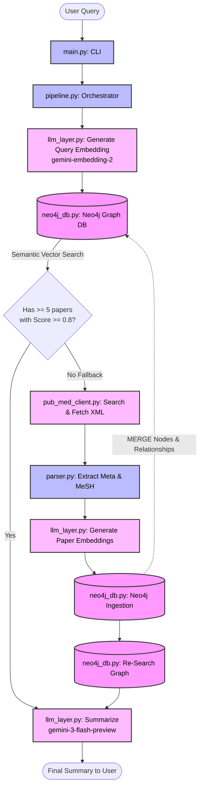

# MedGraph: Medical Knowledge Graph & RAG Pipeline

MedGraph is a hybrid Retrieval-Augmented Generation (RAG) pipeline designed for medical literature. It allows users to query medical topics, searches for relevant research papers from PubMed, stores the extracted data in a Neo4j graph database, and leverages Google's Gemini 3 Flash Preview to generate concise, factual summaries of the findings.

## 🏗 Architecture & Workflow



The system is designed to be highly efficient by acting as a hybrid search pipeline:

1. **Local Semantic Search First:** Upon receiving a user query, the system converts it into a high-dimensional vector using Google's `gemini-embedding-2` model and performs a semantic similarity search against the native Neo4j vector index.
2. **PubMed Fallback:** If there isn't enough local data (fewer than 5 papers), it connects to the NCBI PubMed API to fetch relevant literature dynamically.
3. **Knowledge Graph Ingestion:** The newly fetched XML data is parsed into structured entities (Papers, Authors, and Mesh Terms/Diseases) and ingested into the Neo4j graph, establishing relationships like `Author -[:WROTE]-> Paper` and `Paper -[:ABOUT]-> Disease`.
4. **LLM Summarization:** The combined context of the retrieved abstracts is passed to the Gemini LLM to generate an accurate, unified answer to the user's question.

## 📂 Project Structure (`/app`)

The application logic is encapsulated within the `app` directory:

- **`main.py`**: The main entry point of the application. It runs a command-line interface (CLI) that prompts the user for a query, triggers the pipeline, and prints out the generated summary along with the titles of referenced papers.
- **`pipeline.py`**: The core orchestrator. Contains the `hybrid_pipeline` function which manages the flow of searching the local database, fetching from PubMed if necessary, inserting new data into Neo4j, and calling the LLM layer for summarization.
- **`pub_med_client.py`**: Handles external API communication with the NCBI E-utilities. It searches for relevant PubMed IDs (`search_pubmed`) and fetches the corresponding detailed XML records (`fetch_pubmed_details`).
- **`parser.py`**: Responsible for parsing the raw XML responses from PubMed using `lxml`. It extracts key metadata such as PubMed ID (PMID), Title, Abstract, Authors, and MeSH terms.
- **`neo4j_db.py`**: Manages all interactions with the Neo4j graph database. It handles vector index creation (`_init_vector_index`), executing Cypher queries for inserting parsed paper data with embeddings (`insert_papers`) into a structured graph, and semantically searching for relevant local papers (`search_local`).
- **`llm_layer.py`**: Handles integration with the Google GenAI SDK. It exposes a `generate_embedding` function using `gemini-embedding-2`, constructs prompts with retrieved context, and uses the `gemini-3-flash-preview` model to generate a factual summary.
- **`config.py`**: Loads and manages environment variables from a `.env` file using `python-dotenv`.
- **`requirements.txt`**: Contains the Python package dependencies necessary to run the application.

## 🚀 Setup & Installation

### Prerequisites
- Python 3.8+
- A running Neo4j Database instance
- NCBI API Key (Optional but recommended for higher rate limits)
- Google Gemini API Key

### Installation

1. **Clone the repository and navigate to the project directory:**
   ```bash
   cd med_graph
   ```

2. **Install the dependencies:**
   ```bash
   pip install -r app/requirements.txt
   ```

3. **Configure Environment Variables:**
   Create a `.env` file inside the `app` directory with the following keys:
   ```env
   NCBI_API_KEY=your_ncbi_api_key_here
   
   NEO4J_URI=bolt://localhost:7687
   NEO4J_USER=neo4j
   NEO4J_PASSWORD=your_neo4j_password
   NEO4J_DB=neo4j
   
   GEMINI_API_KEY=your_gemini_api_key_here
   ```

## 💻 Usage

To run the application, execute the `main.py` script from the project root:

```bash
python -m app.main
```

When prompted, enter your medical query (e.g., "What are the latest treatments for Type 2 Diabetes?"). The system will print a synthesized summary followed by a list of source papers.
